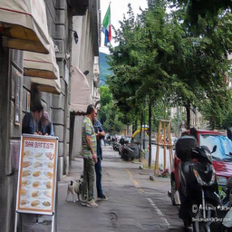
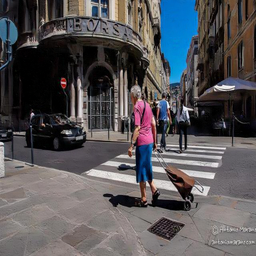

# NYCU VRDL HW4 Image_Restoration by PromptIR
StudentID:110550128  
Name:蔡耀霆
## Introduction:
The task of this project is image restoration. The training and testing data have been specially designed, with noise uniformly distributed across the entire image. Each image contains only one type of noise, and there are only two types of noise: rain and snow. The deep learning model used in this project is based on the concept of PromptIR. The core objective of the model is to handle multiple types of noise within a unified model architecture. It introduces the concept of "prompts," where each prompt corresponds to a specific noise removal task. During the learning process, the model becomes increasingly accurate in interpreting these prompts, enabling better restoration of images affected by specific types of noise.
The model architecture in this project is built upon the framework provided in this GitHub repository: https://github.com/va1shn9v/PromptIR  
## Environment:  
1. You can construct environment on Anaconda by importing env.yml.
2. Download authors github link.
3. Replace datautils.py in utils folder, model.py in net folder, options.py, train.py and test.py.  
## How to run
### Training
1. You should create a folder to put your train and test data.  
2. The directory inside the folder you created can be same as HW4's directory settings.  

3. Command:  
```bash
python train2.py
```
### Testing
Command:  
```bash
python test2.py --mode=1 --ckpt_name={model_name in ckpt folder.}
```
You can look up option.py to modify your requirements if you need. 
## Image Restoration Results

Below are examples of restored images from the PromptIR model:

<table>
  <tr>
    <td></td>
    <td></td>
    <td></td>
    <td></td>
  </tr>
  <tr>
    <td></td>
    <td></td>
    <td></td>
    <td></td>
  </tr>
  <tr>
    <td></td>
    <td></td>
    <td></td>
    <td></td>
  </tr>
</table>

